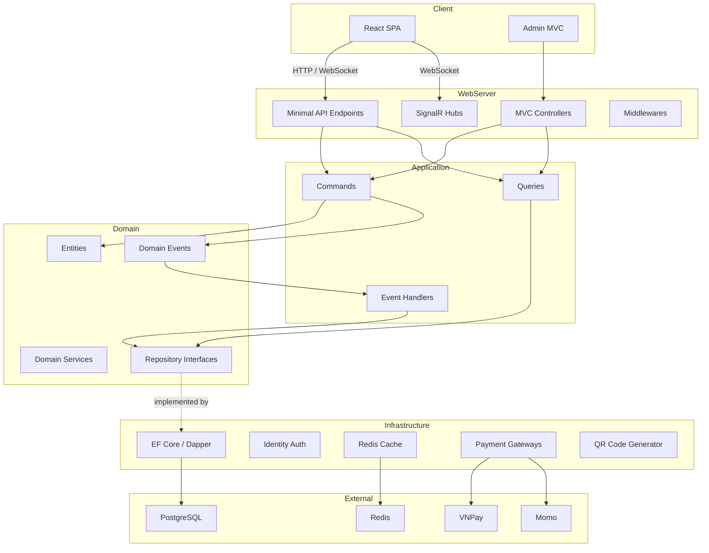
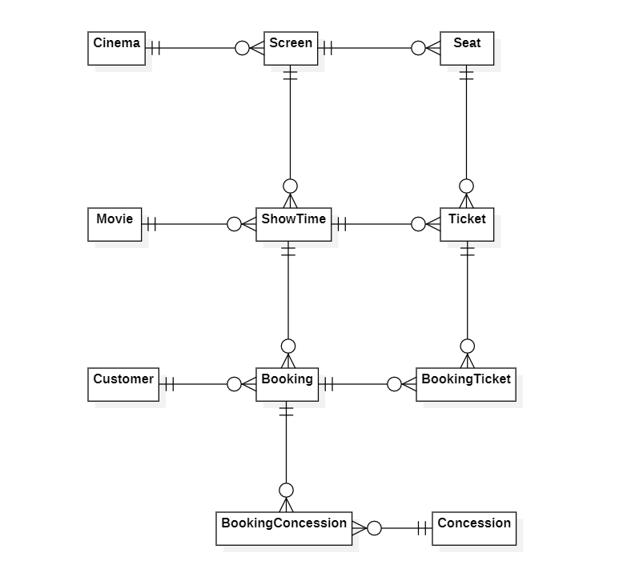

# 🎬 Cinema Ticket Booking

> A full-stack, real-time cinema ticket booking platform built with **.NET 10** and **React 19** — designed to demonstrate production-grade Clean Architecture, domain-driven design, and modern DevOps practices.

---

## 📌 Overview

Cinema Ticket Booking is an end-to-end web application that allows customers to browse movies, select showtimes, choose seats in real-time, and complete payments via VNPay or Momo gateways. An admin panel (ASP.NET Core MVC) provides cinema operators with full control over movies, screens, showtimes, pricing policies, and booking management.

**Goals:**
- Deliver a seamless, real-time booking experience with seat-locking and live status updates.
- Showcase enterprise-level architecture patterns: Clean Architecture, CQRS, Domain Events, and Unit of Work.
- Provide a fully containerized development and production environment with observability built in.

**Target audience:** Recruiters, hiring managers, and developers interested in a well-structured .NET portfolio project.

---

## 🚀 Key Features

| Category | Highlights |
|---|---|
| **🔐 Authentication & Authorization** | ASP.NET Core Identity with JWT + HttpOnly refresh-token cookies, role-based access control, Google & Facebook OAuth |
| **🎟️ Real-time Seat Selection** | SignalR hubs broadcast ticket lock/unlock events instantly — multiple users see the same seat map live |
| **🎟️ Seat Selection Policies** | Flexible policies to prevent invalid seat selection (gaps between seats, orphaned seats, multiple rows, between aisle, etc...) |
| **💳 Online Payment Integration** | VNPay & Momo payment gateways with IPN webhook verification, configurable timeouts and retry logic |
| **📡 Real-time Payment Status** | SignalR `PaymentHub` pushes payment confirmation to the browser the moment the IPN callback arrives |
| **🏷️ Dynamic Pricing** | Flexible pricing policies per screen, day-of-week, and showtime — managed from the admin panel |
| **⚡ Performance & Caching** | Redis for seat-lock state mechanism and response caching |
| **🔒 Recovery jobs** | Background jobs for detecting and recovering from invalid entity states (e.g., showtime not published, payment not completed, ticket not unlocked after timeout) when the system restarts |
| **🖥️ Admin Panel** | Full MVC admin panel for managing Cinemas, Screens, Movies, Showtimes, Pricing, Access control and Dashboard |

---

## 🛠 Tech Stack

### Backend
| Technology | Purpose |
|---|---|
| **.NET 10 / ASP.NET Core** | Web framework — MVC for admin, Minimal APIs for frontend |
| **Entity Framework Core** | ORM, migrations, data seeding |
| **Dapper** | High-performance raw SQL queries where needed |
| **Wolverine 5.x** | CQRS command/query bus + domain event messaging |
| **SignalR** | Real-time WebSocket communication (ticket & payment hubs) |
| **ASP.NET Core Identity** | Authentication, authorization, role management |
| **Scalar** | Interactive API documentation (OpenAPI) |

### Frontend
| Technology | Purpose |
|---|---|
| **React 19** | SPA for customer-facing booking flow |
| **TypeScript** | Type-safe frontend development |
| **Vite** | Lightning-fast dev server & build tool |
| **Tailwind CSS** | Utility-first styling |
| **Axios** | HTTP client for API communication |
| **@microsoft/signalr** | Real-time connection to backend hubs |
| **React Router v7** | Client-side routing |

### Database & Caching
| Technology | Purpose |
|---|---|
| **PostgreSQL 17** | Primary relational database |
| **Redis 7.4** | Distributed caching & seat-lock management |

### DevOps & Observability
| Technology | Purpose |
|---|---|
| **Docker & Docker Compose** | Containerized development & production environments |
| **.NET Aspire** | Service orchestration, service discovery, OpenTelemetry |
| **GitHub Actions** | CI/CD — test → build → push Docker images → deploy |
| **Coolify** | Self-hosted PaaS for deployment on AWS EC2 |
| **Prometheus** | Metrics collection (app + PostgreSQL + Redis + cAdvisor) |
| **Grafana** | Dashboards & alerting |
| **Loki** | Log aggregation |
| **Tempo** | Distributed tracing (OpenTelemetry) |

---

## 🏗 Architecture

### Design Principles

- **Clean Architecture** — strict dependency inversion: Domain → Application → Infrastructure → WebServer
- **Domain-Driven Design (DDD)** — rich domain entities with encapsulated business rules, domain events, and value objects
- **CQRS** — commands and queries separated via Wolverine message bus
- **Repository + Unit of Work** — data access abstraction with transactional consistency
- **Domain Events** — side effects handled through Wolverine messaging pipeline (e.g., `ShowTimePublished → GenerateTickets`)

### System Diagram



### Entity Relationship Diagram



---

## 📂 Project Structure

```
📁 src/
├── Aspire.AppHost/                        # .NET Aspire orchestration, service discovery, OpenTelemetry
├── Aspire.ServiceDefaults/                # Shared Aspire defaults (logging, tracing config)
│
├── CinemaTicketBooking.Domain/            # Core business logic (zero external dependencies)
│   ├── Abstractions/                      # Base entity, generic repository interface
│   ├── Constants/                         # MaxLength constants for validation
│   ├── Entities/                          # Cinema, Screen, Movie, ShowTime, Booking, Ticket, etc.
│   ├── Enums/                             # BookingStatus, PaymentMethod, SeatType, etc.
│   ├── Events/                            # Domain events per aggregate
│   ├── Repositories/                      # Repository interfaces
│   ├── Services/                          # Domain services
│   └── Utilities/                         # Helper utilities
│
├── CinemaTicketBooking.Application/       # Use cases & orchestration
│   ├── Abstractions/                      # Service interfaces, UoW, markers
│   ├── Common/                            # Shared DTOs, pagination, result types
│   ├── Features/                          # CQRS commands & queries per aggregate
│   └── Messaging/                         # Domain event handlers (side effects)
│
├── CinemaTicketBooking.Infrastructure/    # External concerns implementation
│   ├── Auth/                              # Identity, JWT, OAuth, role seeding
│   ├── Cache/                             # Redis cache + NoOp fallback
│   ├── FileStorages/                      # File storage abstraction
│   ├── Notifications/                     # Email sender
│   ├── Payments/                          # VNPay & Momo gateway implementations
│   ├── Persistence/                       # EF Core DbContext, migrations, repositories
│   └── QrCodes/                           # QR code generation
│
├── CinemaTicketBooking.WebServer/         # ASP.NET Core host
│   ├── ApiEndpoints/                      # Minimal API endpoints (Auth, Booking, Movie, etc.)
│   ├── Controllers/                       # MVC admin controllers
│   ├── CronJobs/                          # Background hosted services (lock recovery)
│   ├── Hubs/                              # SignalR hubs (TicketStatusHub, PaymentHub)
│   ├── Middlewares/                       # Global exception handling
│   ├── Models/                            # View models for MVC
│   └── Views/                             # Razor views for admin panel
│
└── CinemaTicketBooking.WebApp/            # React 19 SPA (Vite + TypeScript)
    ├── src/                               # Components, pages, hooks, services
    └── public/                            # Static assets

📁 tests/
├── CinemaTicketBooking.UnitTests/         # Unit tests
└── CinemaTicketBooking.IntegrationTests/  # Integration tests (Testcontainers)

📁 dockers/
├── development/                           # Full dev stack (app + DB + cache + monitoring)
├── production/                            # Production Docker Compose configs
└── monitoring/                            # Grafana dashboards & Prometheus rules

📁 .github/workflows/
└── deploy.yml                             # CI/CD: test → build → push → deploy to Coolify
```

---

## ⚙️ Getting Started


### Option 1: Docker Compose (Recommended)
**Docker Desktop required**

Spin up the entire stack (backend, frontend, database, cache, monitoring) with a single command:

```bash
# 1. Clone the repository
git clone https://github.com/annghdev/cinema-ticket-booking-app-dotnet10.git
cd cinema-ticket-booking-app-dotnet10

# 2. Copy and configure environment variables
cd dockers/development
cp .env.example .env
# Edit .env if you need to change ports or credentials

# 3. Start all services
docker compose up -d

# 4. Access the application
#    - Frontend (React):   http://localhost:5173
#    - Admin panel:        http://localhost:8080
#    - API Docs (Scalar):  http://localhost:8080/scalar/v1
#    - Grafana:            http://localhost:3000
```

### Option 2: Aspire Orchestrator
**Prerequisites**

| Tool | Version |
|---|---|
| [.NET SDK](https://dotnet.microsoft.com/download) | 10.0+ |
| [Node.js](https://nodejs.org/) | 20+ |
| [Docker Desktop](https://www.docker.com/products/docker-desktop/) | Latest |
| [Aspire](https://www.postgresql.org/) | 13.2|


```bash
# 1. Clone the repository
git clone https://github.com/annghdev/cinema-ticket-booking-app-dotnet10.git
cd cinema-ticket-booking-app-dotnet10

# 2. Ensure your credentials are configured in appsettings.json

# 3. Ensure Docker Destop is running

# 4. Ensure Aspire CLI is installed with lasted version
dotnet tool install --g Aspire.Cli 
# or if already installed
aspire update --self

# 5. Run Aspire Orchestrator
aspire run src/Aspire.AppHost/Aspire.AppHost.csproj

# 6. Run the frontend
cd src/CinemaTicketBooking.WebApp
npm install
npm run dev
```

### Default Accounts

The application seeds the following accounts on first run:

| Role | Username | Email | Password |
|---|---|---|---|
| SysAdmin | `sysadmin` | `sysadmin@cinema.com` | `SysAdmin@123!` |
| Admin | `admin` | `admin@cinema.com` | `Admin@123!` |
| Manager | `manager` | `manager@cinema.com` | `Manager@123!` |
| TicketStaff | `ticketstaff` | `staff@cinema.com` | `Staff@123!` |
| Coordinator | `coordinator` | `coordinator@cinema.com` | `Coordinator@123!` |
| Customer | `customer` | `customer@cinema.com` | `Customer@123!` |

### Environment Configuration

Key configuration sections in `appsettings.json`:

| Section | Description |
|---|---|
| `ConnectionStrings:cinemadb` | PostgreSQL connection string |
| `ConnectionStrings:redis` | Redis connection string (optional — app works without it) |
| `Jwt` | JWT issuer, audience, signing key, token lifetime |
| `VnPay` | VNPay gateway credentials and endpoints |
| `Momo` | Momo gateway credentials and endpoints |
| `Cors:AllowedOrigins` | Allowed frontend origins |
| `Authentication:Google/Facebook` | OAuth provider credentials |

---

## 📸 Demo

**Live Demo**

| | |
|---|---|
| Frontend React SPA | **https://annghdev.online** |
| Admin Panel (MVC) | **http://cinemaserver.annghdev.online** |
| Backend API Docs | **http://cinemaserver.annghdev.online/scalar/v1** |

---

## 📬 Contact

| | |
|---|---|
| **Name** | `Nguyễn Hữu An` |
| **Email** | `annghdev@gmail.com` |
| **Zalo** | `0933 912 012` |

---

## 📄 License

This project is licensed under the [MIT License](LICENSE.txt).